# Configuración de la Pila LAMP en Docker

## Índice

- [Configuración de la Pila LAMP en Docker](#configuración-de-la-pila-lamp-en-docker)
  - [Índice](#índice)
  - [Requisitos Previos](#requisitos-previos)
  - [Estructura del proyecto](#estructura-del-proyecto)
  - [Configuración de Virtual Host](#configuración-de-virtual-host)
    - [1. Cambio de nombres](#1-cambio-de-nombres)
      - [1.1. Editar al archivo de hosts](#11-editar-al-archivo-de-hosts)
      - [1.2. Entrar en la configuración de Apache](#12-entrar-en-la-configuración-de-apache)
      - [1.3. Cambiar la configuración](#13-cambiar-la-configuración)
        - [angel-munoz-www.local](#angel-munoz-wwwlocal)
        - [angel-munoz-intranet.local](#angel-munoz-intranetlocal)
      - [1.4. Reiniciar Docker-Compose](#14-reiniciar-docker-compose)
    - [2. Crear Virtual Host para PhpMyAdmin](#2-crear-virtual-host-para-phpmyadmin)
    - [3. Cambiar index.html (Intranet)](#3-cambiar-indexhtml-intranet)
    - [4. Crear usuario nuevo (Intranet)](#4-crear-usuario-nuevo-intranet)
    - [5. Instalar Wordpress CMS](#5-instalar-wordpress-cms)
  - [Instalación de Certificados SSL](#instalación-de-certificados-ssl)
    - [1. Generar certificados](#1-generar-certificados)
      - [1.1 Crear Directorio](#11-crear-directorio)
      - [1.2 Generar Certificados](#12-generar-certificados)
        - [HTTPS](#https)
    - [2. Configurar protocolo HTTPS](#2-configurar-protocolo-https)
    - [3. Activar mod\_ssl](#3-activar-mod_ssl)

## Requisitos Previos

Partimos de la base de un servidor web Apache desplegado.
El tutorial para hacerlo se encuentra en el archivo `readme.md` dentro de [este repositorio](https://github.com/antonio-gabriel-gonzalez-casado/docker-lamp/)


## Estructura del proyecto
La estructura tomará la siguiente forma:
```
-- .gitignore
|-- LICENSE
|-- README.md
|-- apache2-php
| |-- certs
| | |-- intranet.crt
| | |-- intranet.key
| | |-- phpmyadmin.crt
| | |-- phpmyadmin.key
| | |-- www.crt
| | └-- www.key
| |-- Dockerfile
| |-- conf
| | |-- 000-default.conf
| | |-- intranet.conf
| | └-- angel-munoz-phpmyadmin.conf
| |-- etc
| | └-- apache2
| | └-- .htpasswd
| └-- www
| |-- index.html
| |-- intranet
| | └-- index.html
| |-- phpinfo.php
| |-- test-bd.php
| └-- wordpress
| └-- carpetas del entorno...
|-- dist
| |-- env.dist
| └-- htpasswd.dist
|-- docker-compose.yml
|-- docs
| └-- images
└-- mysql
|-- conf
└-- dump
└-- myDb.sql
```

## Configuración de Virtual Host

### 1. Cambio de nombres

Cambia los nombres del virtual host a los requeridos por el ejercicio:

- `www.local` pasa a ser `angel-munoz-www.local`
- `intranet.local` pasa a ser `angel-munoz-intranet.local`

#### 1.1. Editar al archivo de hosts

Ubicación del archivo:

- **Windows:** C:\Windows\System32\drivers\etc\hosts
- **Linux/Mac:** /etc/hosts

Agrega las siguientes lineas:

```
127.0.0.1    angel-munoz-www.local
127.0.0.1    angel-munoz-intranet.local
```

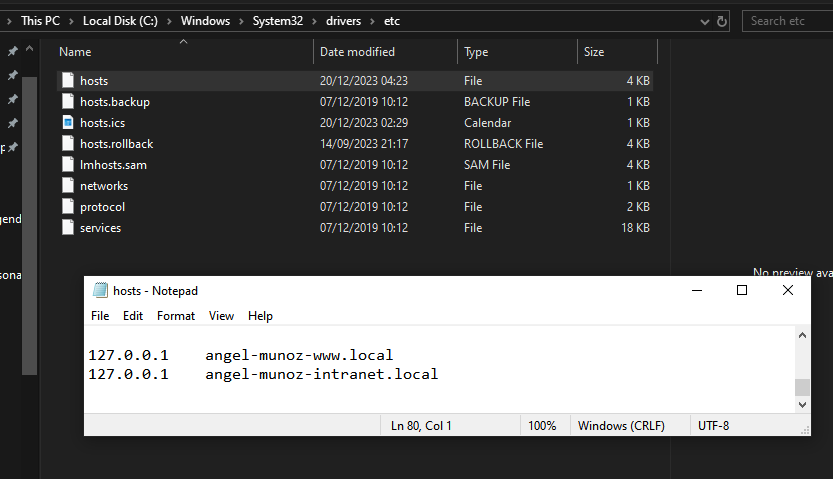

#### 1.2. Entrar en la configuración de Apache

Ubicación del archivo:

- **apache2-php/conf/000-default.conf:** aqui estará `angel-munoz-www.local`
- **apache2-php/conf/intranet.conf:** aqui estará `angel-munoz-intranet.local`

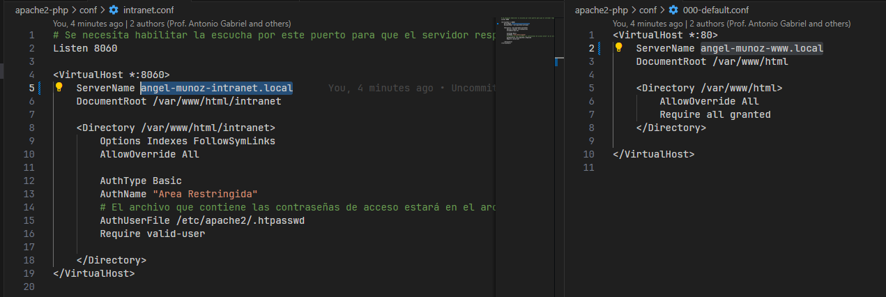

#### 1.3. Cambiar la configuración

Cambia los `ServerName` para que contengan los nombres actualizados

##### angel-munoz-www.local

```
<VirtualHost *:80>
    ServerName angel-munoz-www.local
    DocumentRoot /var/www/html

    <Directory /var/www/html>
        AllowOverride All
        Require all granted
    </Directory>
</VirtualHost>
```
##### angel-munoz-intranet.local
```
Listen 8060

<VirtualHost *:8060>
    ServerName angel-munoz-intranet.local
    DocumentRoot /var/www/html/intranet

    <Directory /var/www/html/intranet>
        Options Indexes FollowSymLinks
        AllowOverride All

        AuthType Basic
        AuthName "Area Restringida"
        AuthUserFile /etc/apache2/.htpasswd
        Require valid-user
    </Directory>
</VirtualHost>
```

#### 1.4. Reiniciar Docker-Compose

Reinicia docker-compose para guardar los cambios:

```
docker-compose restart
```

Vamos a comprobar que todo funciona entrando a la URL:

http://angel-munoz-www.local

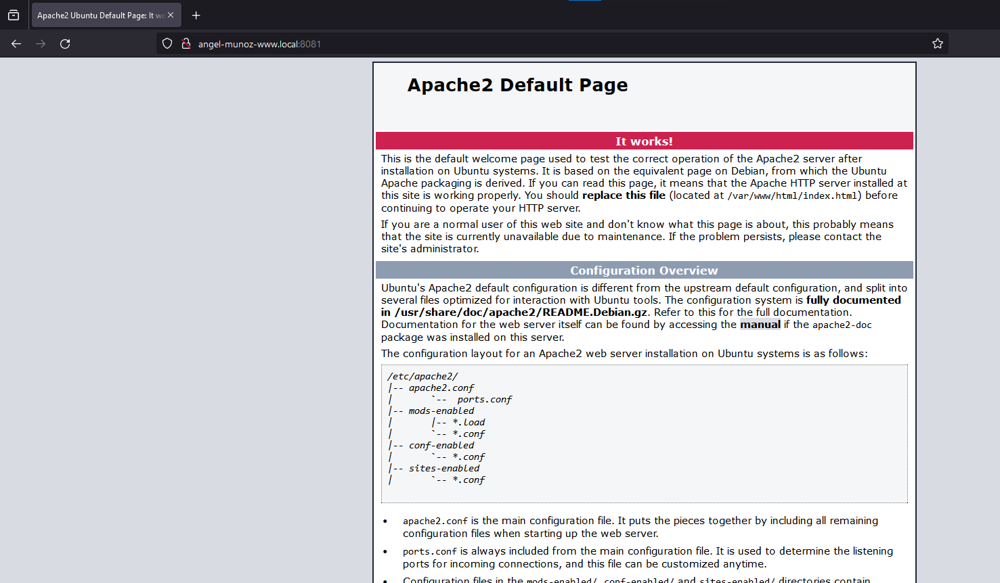

### 2. Crear Virtual Host para PhpMyAdmin

Creamos un archivo de configuración que se llame angel-munoz-phpmyadmin.local:8081.

```
Listen 8081

<VirtualHost *:8081>
    ServerName angel-munoz-phpmyadmin.local

    <Location />
        Options Indexes FollowSymLinks
        AllowOverride All

        AuthType Basic
        AuthName "Area Restringida"
        AuthUserFile /etc/apache2/.htpasswd
        Require valid-user
    </Location>

    ProxyPreserveHost On
    ProxyPass / http://phpmyadmin:80/
    ProxyPassReverse / http://phpmyadmin:80/
</VirtualHost>
```

Esto hace que angel-munoz-phpmyadmin.local te redirija a la página de phpMyAdmin

### 3. Cambiar index.html (Intranet)

Ubicación:

[apache2-php/www/intranet/index.html](apache2-php/www/intranet/index.html)

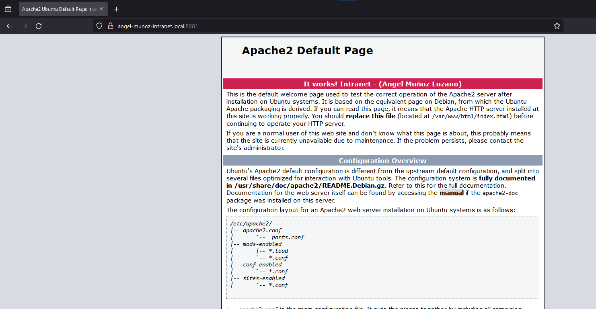

### 4. Crear usuario nuevo (Intranet)

Ubicación:

[apache2-php/etc/apache2/.htpasswd](apache2-php/etc/apache2/.htpasswd)

Crea un usuario nuevo con el formato `nombre-apellidos`  
Para cifrar la contraseña, usa la página [wtools.io](https://wtools.io/generate-htpasswd-online)


Resultado de usuario con contraseña cifrada:

`Angel:$apr1$7fqkhaju$8AjgJGX1QhpNxFBvXoFeZ1`

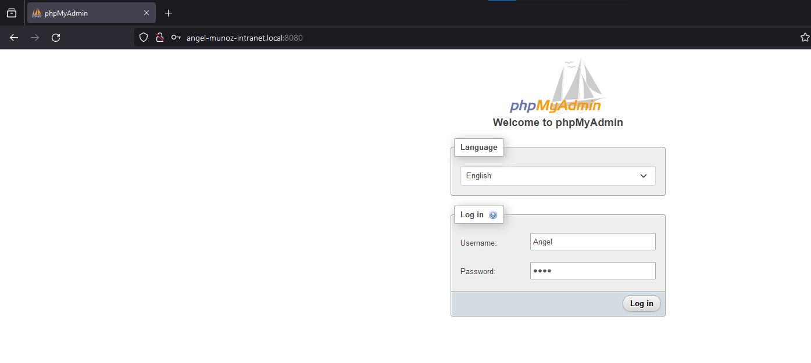

### 5. Instalar Wordpress CMS
Lo primero es acceder al menú de phpMyAdmin utilizando el usuario y contraseña configurados. Al hacerlo entraremos en una ventana similar a la siguiente. El primer paso será ir a la sección para ver todas las bases de datos, se encuentra en el header superior.

Entra al menu de phpMyAdmin, y navega hasta las bases de datos.

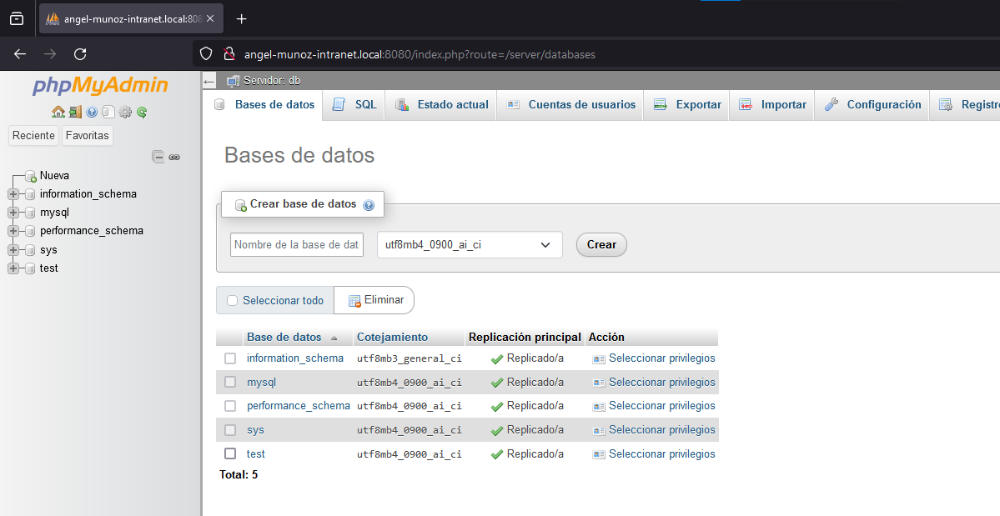

Crea una base de datos llamada WordPress


Entra al menu y crea una nueva Cuenta de Usuario.
nombre: `wordPress`
Activamos todos los permisos para esta cuenta (checkbox).

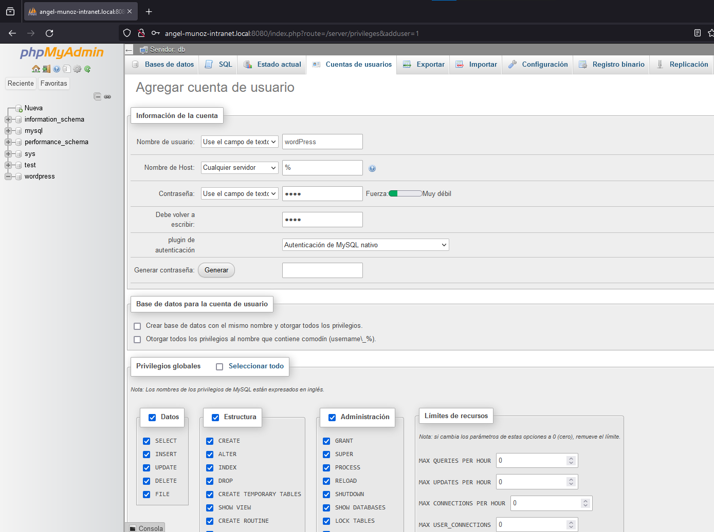
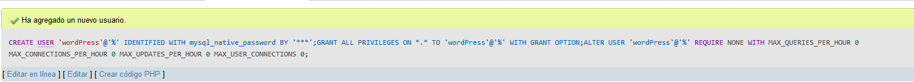

Ahora, descarga [WordPress](https://es.wordpress.org/download/)

Guarda la carpeta en `apache2-php/www`.  
Resultado:  

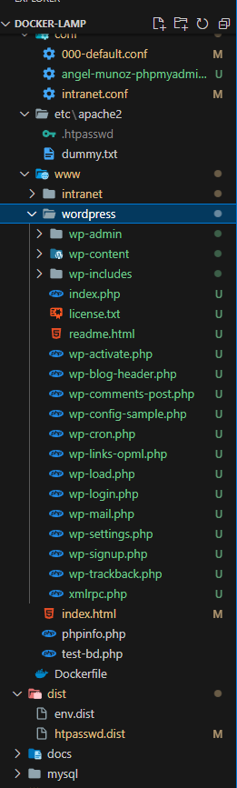

Dentro de esta carpeta hay que modificar el archivo ```wp-config.php``` y asignarles los valores de nuestra base de datos creada en phpMyAdmin en este archivo de configuración; nombre de la base de datos, usuario, contraseña y el host. Este último se puede encontrar en la parte superior de phpMyAdmin.

Cambia `wp-config.php`, aplicando los datos de nuestra base de datos:  
`nombre`, `usuario`, `contraseña`, `host`. 
Para encontrar el host, entra en phpMyAdmin y localizado en la parte de arriba.

Tras todo esto, reinicia docker-compose 
```docker-compose restart```

Instala Wordpress en esta URL:  
http://example.com/wp-admin/install.php

Para acceder a la instalación de WordPress, asegúrate de agregar la ruta `/wordpress` antes de `/wp-admin`
La URL completa para la instalación sería:

[http://angel-munoz-intranet.local/wordpress/wp-admin/install.php](http://angel-munoz-intranet.local/wordpress/wp-admin/install.php)

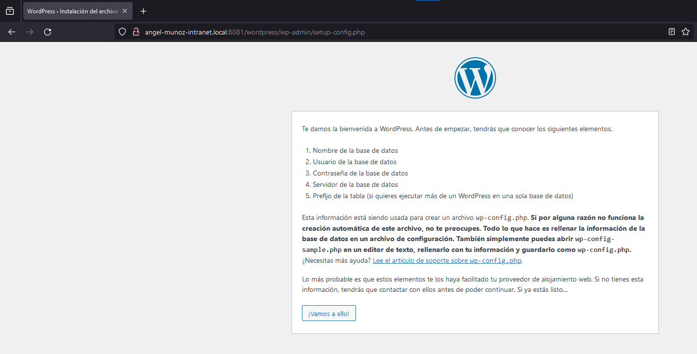
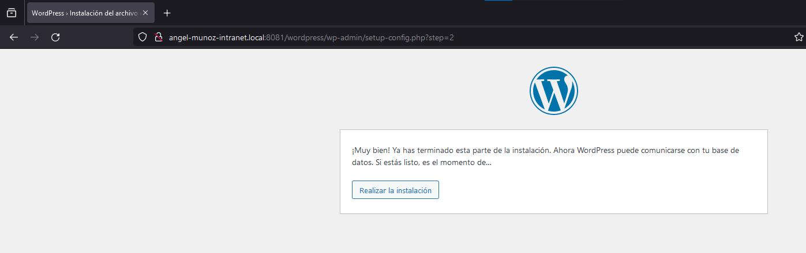

Configura el `título`, `usuario` y `contraseña`, y luego confirma la instalación de Wordpress.

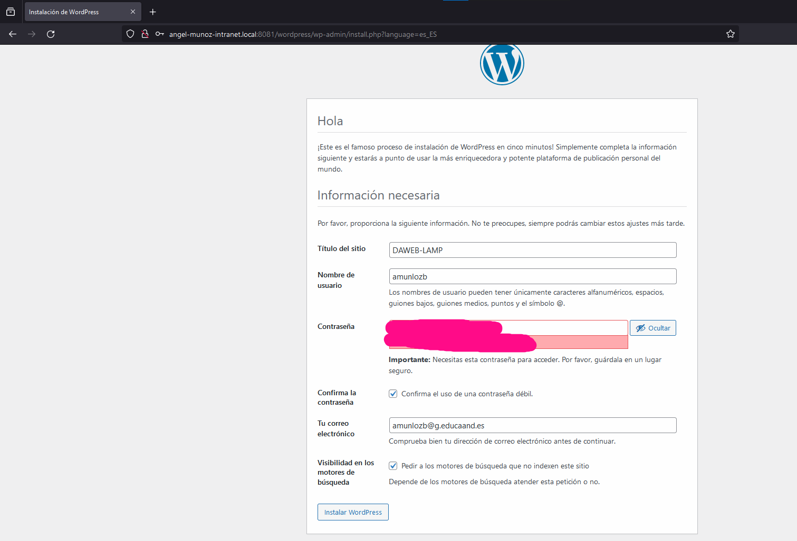

A continuación, realiza el login con los datos introducidos:

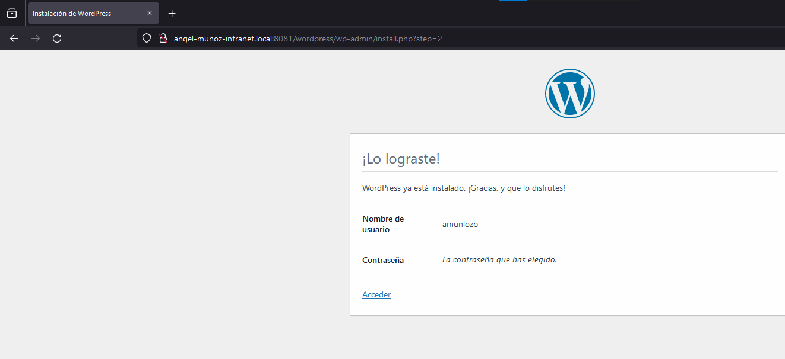
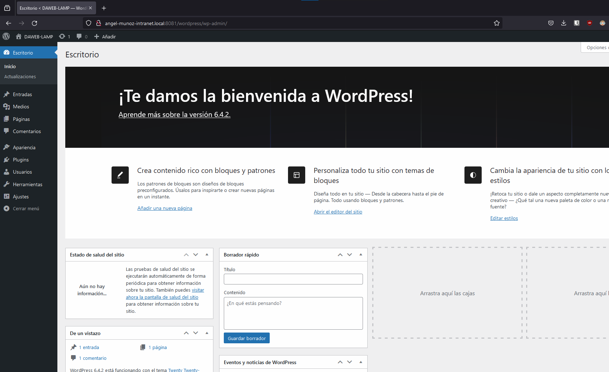
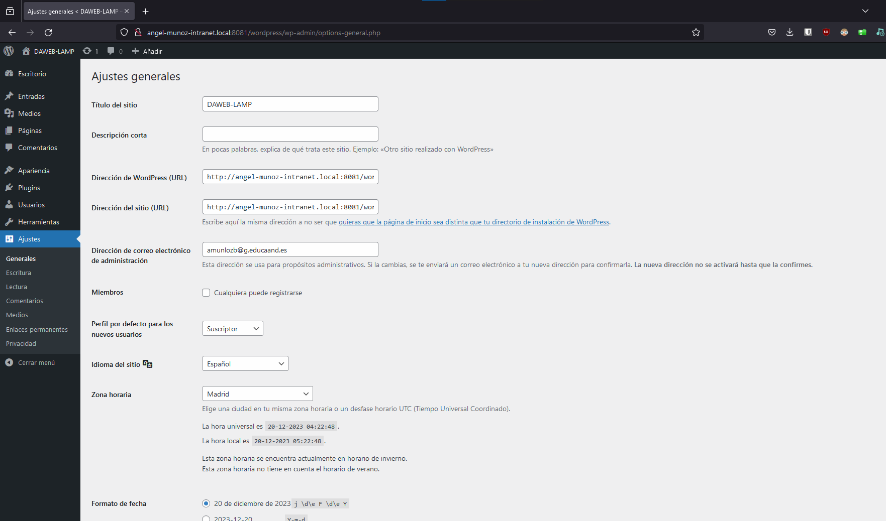

## Instalación de Certificados SSL

### 1. Generar certificados

#### 1.1 Crear Directorio

Crea una carpeta en `apache2-php`. Luego sitúate en ella a traves de comandos.
Llama a la carpeta `certs`

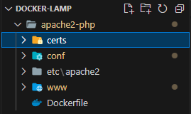

#### 1.2 Generar Certificados

Primero, genera el certificado local:
```
openssl req -x509 -nodes -days 365 -newkey rsa:2048 -keyout www.key -out www.crt
```
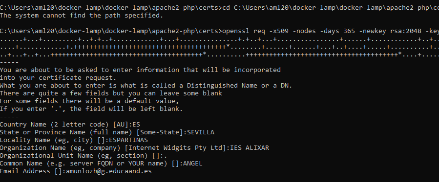
Luego, genera el certificado de intranet:
```
openssl req -x509 -nodes -days 365 -newkey rsa:2048 -keyout intranet.key -out intranet.crt
```

Para el campo `Common Name`, usa los dominios (en este caso, www.local, intranet.local)


##### HTTPS

Genera el certificado HTTPS para el virtual host de phpMyAdmin (`angel-munoz-phpmyadmin.local`) a traves del siguiente comando:

```
openssl req -x509 -nodes -days 365 -newkey rsa:2048 -keyout phpmyadmin.key -out phpmyadmin.crt
```
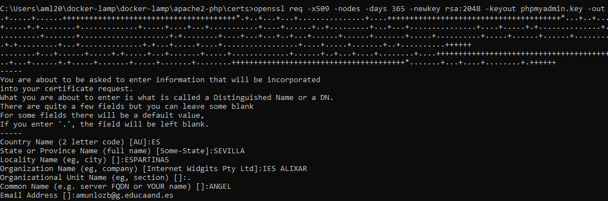

### 2. Configurar protocolo HTTPS
Agrega una regla nueva para cada archivo config, tras la etiqueta `Directory`

[**Para angel-munoz-www.local**](apache2-php/conf/000-default.conf)
```
SSLEngine on
SSLCertificateFile /etc/apache2/ssl/www.crt
SSLCertificateKeyFile /etc/apache2/ssl/www.key
```

[**Para angel-munoz-intranet.local**](apache2-php/conf/intranet.conf)
```
SSLEngine on
SSLCertificateFile /etc/apache2/ssl/intranet.crt
SSLCertificateKeyFile /etc/apache2/ssl/intranet.key
```

[**Para angel-munoz-phpmyadmin.local**](apache2-php/conf/angel-munoz-phpmyadmin.conf)
```
SSLEngine on
SSLCertificateFile /etc/apache2/ssl/phpmyadmin.crt
SSLCertificateKeyFile /etc/apache2/ssl/phpmyadmin.key
```
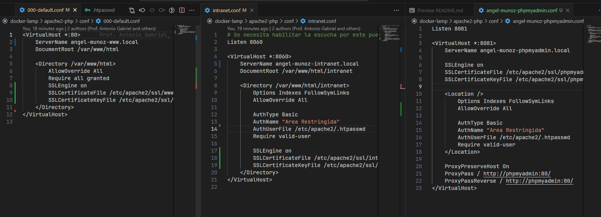

### 3. Activar mod_ssl
Agrega esto al Dockerfile:
```
COPY ./certs /etc/apache2/ssl

RUN a2enmod ssl
```

Así quedaría finalmente el dockefile (y el directorio `certs` a la izquierda):

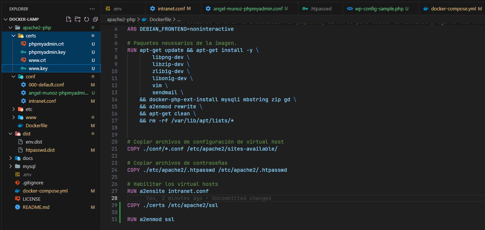

Con esto, el proyecto queda completamente finalizado.
